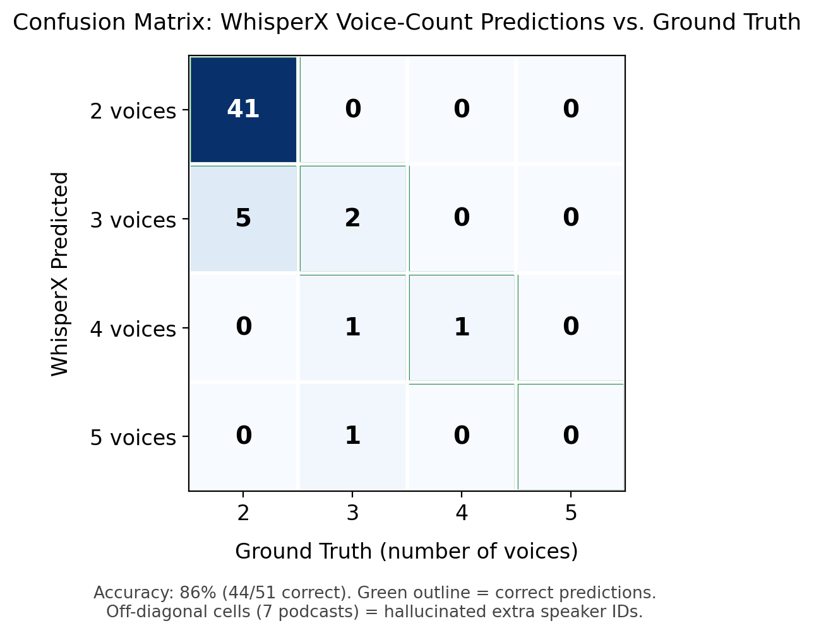

# NotebookLM Podcast Dataset with WhisperX Speaker Diarization

## Overview

This dataset contains **51 AI-generated podcast episodes** produced using
Google's **NotebookLM "Audio Overview"** feature, each based on a different
source paper/document. Every episode has been transcribed and diarized using
[WhisperX](https://github.com/m-bain/whisperX), and comes with structured
metadata describing how it was generated.

## Contents

```
dataset/
├── main/                    # 41 episodes — clean, standard 2-speaker diarization
│   ├── *.wav
│   ├── *.txt                       # plain transcript
│   └── *_diarization.txt           # speaker-labeled transcript
├── hallucinated/             # 10 episodes — 2 real speakers, but 3+ voice IDs detected
│   ├── *.wav
│   ├── *.txt
│   └── *_diarization.txt
├── NotebookLM_podcasts_MetaData.csv   # per-episode generation metadata
├── speaker_audit.pdf                  # diarization quality review (see below)
└── README.md
```

## Dataset Details

| Field | Value |
|---|---|
| **Source** | Podcasts generated via NotebookLM's Audio Overview feature |
| **Number of episodes** | 51 |
| **Total audio duration** | ~13.5 hours (48,540 seconds) |
| **Average episode length** | ~15.9 minutes (951.8 seconds) |
| **Shortest / longest episode** | 5.7 min / 26.5 min |
| **Total transcript length** | ~175,700 words across all episodes |
| **Average transcript length** | ~3,445 words per episode |
| **Audio format** | WAV, mono, 24kHz, 16-bit PCM |
| **Language** | English |
| **Speakers per episode** | 2 (one male-presenting, one female-presenting AI voice) |
| **Diarization tool** | WhisperX (ASR + forced alignment + speaker diarization) |
| **Source material dates** | Papers/documents dated 20.06.2025 – 02.07.2025 |

## Metadata CSV

`NotebookLM_podcasts_MetaData.csv` contains one row per episode with the
following columns:

| Column | Description |
|---|---|
| `Paper` | Title of the source paper/document the podcast was generated from |
| `Date` | Date the source material is dated (DD.MM.YYYY) |
| `Prompt` | The custom instruction given to NotebookLM to steer the podcast's focus (e.g. *"Focus on the importance of the topic"*, *"Discuss the limitations of the study"*, or `Default` if no custom prompt was used) |
| `Duration (Seconds)` | Length of the generated audio, in seconds |
| `Tokens (Words)` | Word count of the generated transcript |
| `Opening (Who starts speaking)` | Which voice (`man` / `woman`) speaks first in the episode |

**Prompt distribution:** 12 distinct prompt types were used across the 51
episodes, including general framing prompts (*"Focus on the importance of
the topic"*, *"Explain the topic to the new audience"*) and more targeted
ones (*"Focus on the methods presented in the paper"*, *"Discuss the
limitations of the study"*). About 14% of episodes used NotebookLM's
default prompt (no custom instruction).

**Opening speaker balance:** Roughly balanced — 27 episodes open with the
male-presenting voice, 24 with the female-presenting voice.

## Diarization Format

Each `*_diarization.txt` file contains timestamped, speaker-labeled lines:

```
[0.03-1.57] Speaker SPEAKER_00: Welcome to The Deep Dive.
[2.31-4.54] Speaker SPEAKER_00: You know, it seems almost unbelievable, doesn't it?
[13.01-13.71] Speaker SPEAKER_01: It really can.
```

Each `*.txt` file (without the `_diarization` suffix) contains the same
content as a single continuous plain-text transcript, with no timestamps or
speaker labels — useful for text-only NLP tasks.

## Speaker Diarization Audit

See **`speaker_audit.pdf`** for a full quality review of the diarization
output. In short:

- **41 episodes** were diarized cleanly (exactly 2 speaker IDs, matching
  the 2 real voices).
- **10 episodes** ended up in the `hallucinated/` folder because WhisperX
  detected **3–5 distinct speaker IDs**, even though manual review confirms
  only 2 real speakers are present. This happens when one AI voice shifts
  slightly in tone/pitch and gets mistaken for a new speaker — a voice
  generation/diarization artifact, not an error in the transcript content
  itself.

  



## How This Dataset Was Created

1. Source papers/documents were uploaded to NotebookLM, along with a
   custom prompt (or the default) steering what the podcast should focus on.
2. NotebookLM's Audio Overview feature generated a two-host podcast-style
   discussion based on the source material and prompt.
3. The generated audio was processed with **WhisperX** to produce:
   - Accurate speech-to-text transcription
   - Word-level timestamp alignment
   - Speaker diarization (separating the two AI voices)
4. Diarization output was manually reviewed; episodes with more than 2
   detected speaker IDs were separated into `hallucinated/` (see audit above).

## Intended Use

This dataset is useful for:
- Speaker diarization research and benchmarking
- Studying synthetic/AI-generated conversational speech
- ASR and alignment model evaluation
- Prompt-conditioning research (how instruction phrasing affects generated
  podcast length, focus, and structure)
- Podcast-style dialogue generation research

## Limitations

- Audio is entirely AI-generated (synthetic voices), not real human speakers.
- Diarization quality depends on WhisperX/pyannote performance; 10 of 51
  episodes have known extra speaker-ID artifacts (see audit).
- Content is derived from NotebookLM summaries and may contain
  hallucinated or simplified information relative to source material.

## License

**Creative Commons Zero v1.0 Universal (CC0)** — public domain, no
attribution required.

⚠️ Note: NotebookLM's terms of service should be checked regarding
redistribution of generated audio, since the audio itself was produced via
a third-party tool.

## Citation

This dataset was used in the following peer-reviewed publication. If you
use this dataset, please cite the paper:
 
```
@inproceedings{saloev2026rhythm,
  author    = {Saloev, Artem and Ballier, Nicolas},
  title     = {Rhythm Variability in NotebookLM Podcasts},
  booktitle = {Speech Prosody 2026},
  year      = {2026},
  address   = {Philadelphia, Pennsylvania, USA},
  month     = {May},
  doi       = {10.21437/SpeechProsody.2026-182},
  pages     = {897--901}
}
```
 
You're also welcome to cite the dataset repository itself:

```
@dataset{saloev_2026_notebooklm_podcast_diarization,
  author    = {Saloev Artem, Ballier Nicolas},
  title     = {NotebookLM Podcast Dataset with WhisperX Speaker Diarization},
  year      = {2026},
  publisher = {GitHub},
  url       = {https://github.com/artemsaloev/NotebookLM-Generated-Podcasts}
}
```

## Acknowledgements

- [NotebookLM](https://notebooklm.google.com/) by Google
- [WhisperX](https://github.com/m-bain/whisperX) for ASR + diarization
